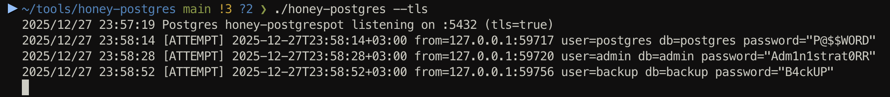

# honey-postgres
PostgreSQL Honeypot in Golang

## Usage
```
frakenbok@frakenbok$ honey-postgres -h
Usage of ./honey-postgres:
  -o string
    	output file for captured credentials
  -port int
    	port to listen on (default 5432)
  -tls
    	enable TLS (self-signed cert)
```

## Demo
